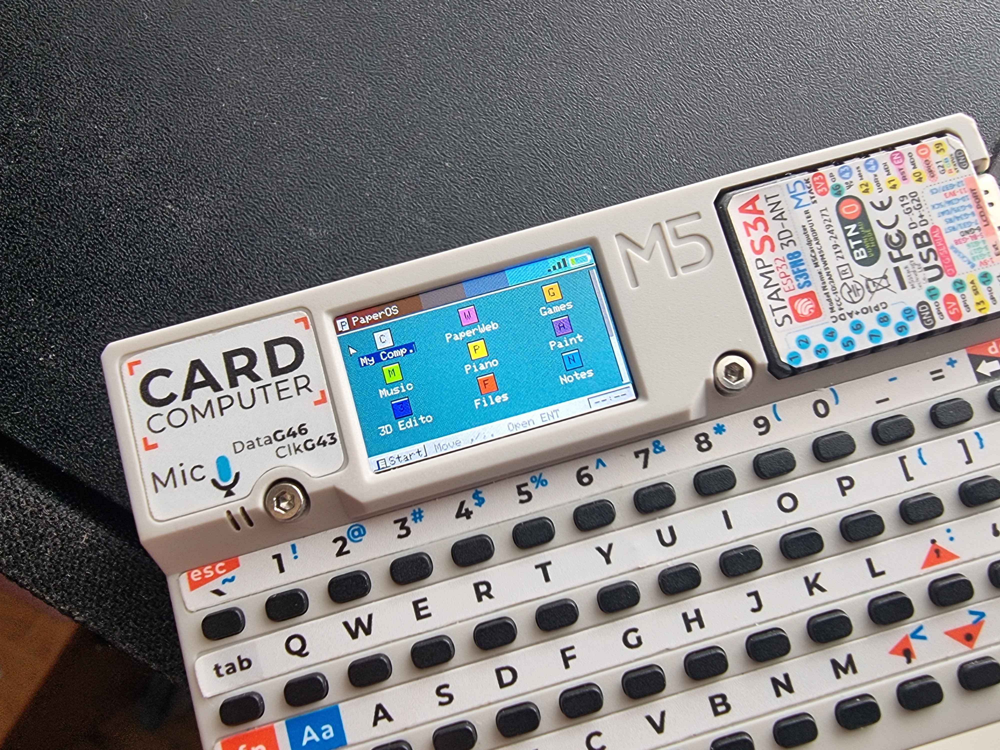
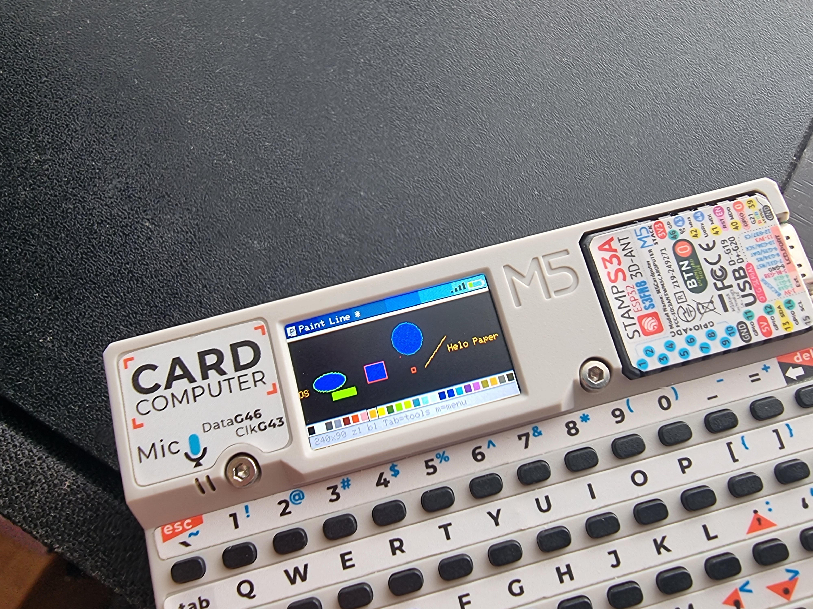
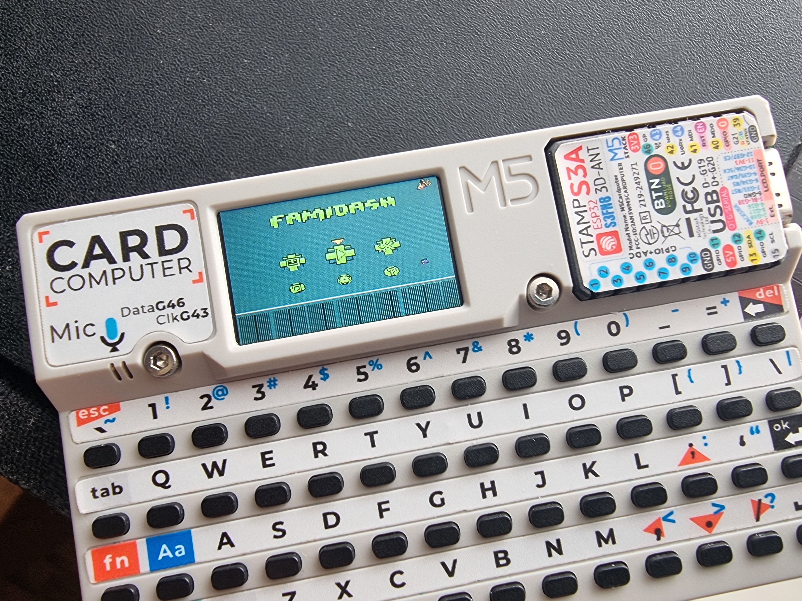
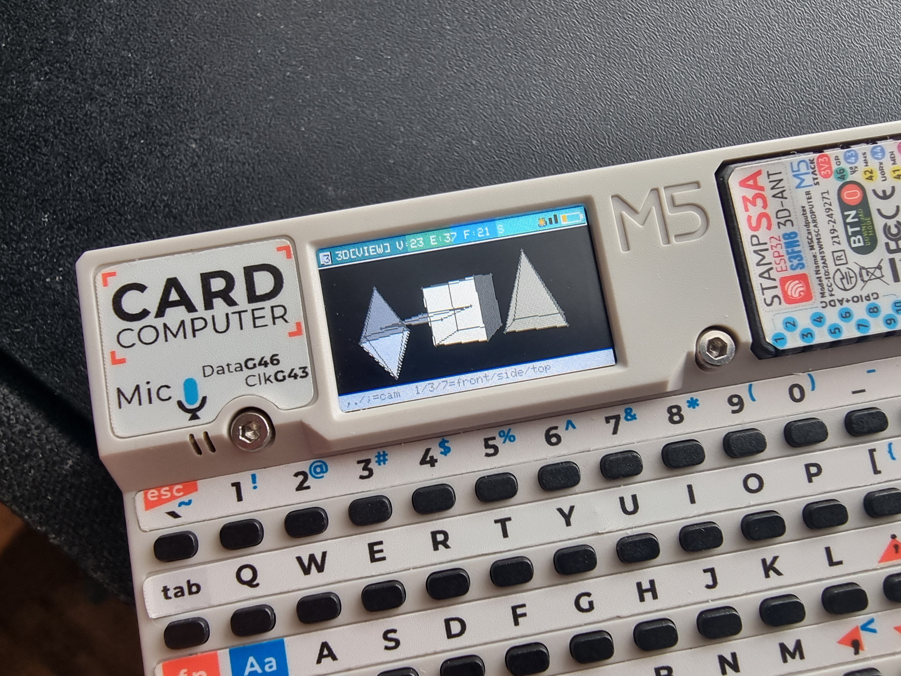
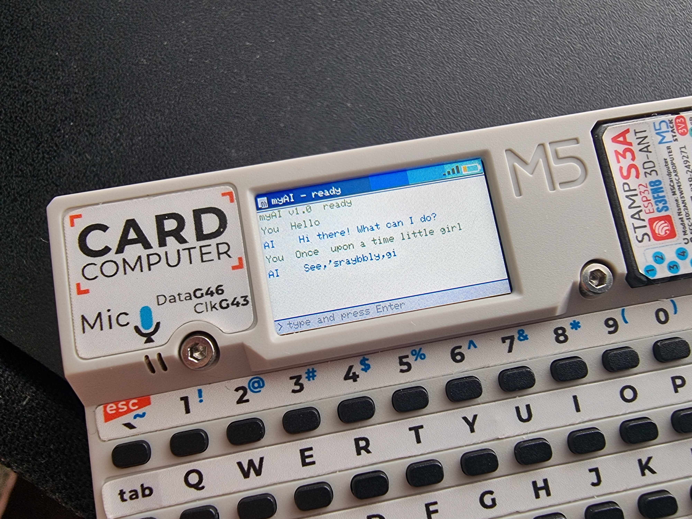
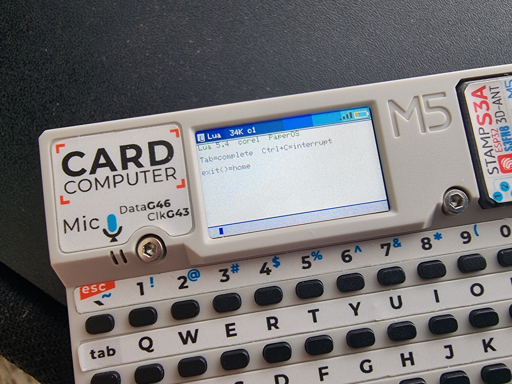

# PaperOS

A whole little OS for the M5Stack Cardputer. Launcher, file manager, paint, a text browser, a game emulator, an offline AI chat, a 3D editor, and a Lua console. First public release, so expect some rough edges, listed honestly below.

## Get it running

1. Build with `pio run -e paperos-cardputer`, then run `merge.py` to bundle bootloader + partitions + firmware + LittleFS into `PaperOS_full.bin`.
2. Flash the whole `PaperOS_full.bin` to address `0x0`. If you're updating from an older build, do a full reflash, not incremental, the partition table has changed a few times.
3. Put a FAT32 SD card in before first boot.

## Before you touch each app

| App | Needs |
|---|---|
| Games | `.nes`/`.gb`/`.gbc` need `PaperEMU.extension` (grab it from Releases, or use `EmulatorV3.4.extension` from AdvanceOS-for-cardputer if you prefer) + your ROMs, both in `/games/`. `.ard` (Arduboy) games need nothing extra, just the ROM in `/games/` |
| myAI | `model.bin` in the SD card **root** |
| Music | `.wav`/`.mp3` in `/music/` (or open one from File Manager, it'll copy itself over) |
| 3D Editor | `.obj` files in `/3d/` |
| Browser | saves pages to `/saved_links/` |
| Paint | opens/saves anywhere, any name, no fixed folder |

## The apps

**File Manager** knows what it's looking at, images open in a viewer with zoom/pan/rotate, ROMs launch through the emulator, audio hands off to Music, everything else gets identified instead of dumped as garbled text. `M` for a context menu instead of memorizing hotkeys.

**Paint**: Pen, Line, Rect, FillRect, Ellipse, Circle, Triangle, Fill, Eraser, EyeDropper, Outline, Text. `Tab` opens tools/colors, Enter picks and closes it, `M` for Save/Open/New/Exit.

**Games**: NES and GB/GBC through PaperEMU (`EmulatorV3.4.extension` from AdvanceOS-for-cardputer works too, if that's what you've got). Arduboy `.ard` games flash straight to the spare OTA slot, no emulator extension needed. First launch of a `.nes`/`.gb`/`.gbc` ROM flashes the emulator into that same OTA slot; after that, switching games is just a reboot.

**Music**: WAV/MP3 player, volume and play/pause.

**Browser**: text only, no JS/CSS/images. Started as its own project (PaperWeb) before moving in here. `D` saves a page, `B`/`L` for bookmarks, `OPT` for its own file manager.

**myAI**: a tiny language model trained from scratch on TinyStories, fully offline. There's no RAM to hold the model, so it rereads its weights off the SD card for every single character it generates. That means replies are genuinely slow (the screen shows a live `thinking X/95 Ns` counter so it doesn't look frozen) and short. This is the actual mechanism, not a bug.

**3D Editor**: orbit/vertex editing for `.obj` meshes, `Tab` switches modes, `1`/`3`/`7` for front/side/top view.

**Lua**: a real Lua 5.4 console with its own API. `Tab` completes, `Ctrl+C` interrupts, `dofile(path)` runs a script.

Quick reference by table:

- `os.*`: clock, time, launch(name), heap(), reset(), bright(0-100), millis(), cpu(), apps(), frametime()
- `fs.*`: ls(path, asTable), read, write, rm, mkdir, exists, size, rename, copy, free, total
- `net.*`: ip, mac, ssid, rssi, status, scan, connect, disconnect, get(url), post(url, body)
- `gpio.*`: mode, write, read, aread, awrite, tone, notone
- `disp.*`: cls, print, pixel, line, rect, fillrect, circle, fillcircle, triangle, text, clip, flip (call flip to push to screen)
- `key.*`: pressed(name), justPressed(name), released(name), any(), poll(). Names: up/down/left/right, enter, tab, del, ctrl, shift, fn, space, esc, or any single key
- `sound.*`: tone, note("C4"), stop, volume, play(path)
- `timer.*`: every(ms, fn), after(ms, fn), cancel(id)
- `ui.*`: confirm, toast, inputText, progress, menu({...})
- `store.*`: get/set, persists across reboots
- `json.*` / `bit.*` / `i2c.*`: as you'd expect
- `loop(fn, fps)`: the game loop driver, calls fn() until it returns false or Ctrl+C
- standard `io.open`/`file:read`/`file:write` on top of the same filesystem

**Notes / Calculator / Clock / Piano / Settings / SysInfo**: smaller utility apps, all with `;`/`.`/Enter/`` ` `` style controls, self-explanatory once you're in them. SysInfo is just a quick read-only screen of device stats.

## Known issues

- Browser is slow on big pages and the bookmark menu can lag sometimes. Text-only by design, always will be.
- myAI gives short, sometimes broken sentences and is genuinely slow, see above, that part's expected. If it just sits on "ready" forever and never responds at all, that's an actual bug, please report it with a screenshot.
- Lua's API is new, heavy scripts (big graphics loops, deep recursion) haven't all been stress-tested yet.
- PNG/JPG viewing in File Manager depends on an M5GFX feature that isn't guaranteed to build on every library version. BMP always works regardless.
- If anything crashes or reboots on its own, that's worth reporting with what you were doing right before.

## Reporting bugs

Say what you did, what you expected, what happened instead. Screenshots help a lot since the screen is small.

## Credits

Built by Artem76228. Emulator core is GPLv2-licensed (source included in this repo) and compatible with the AdvanceOS-for-cardputer emulator. myAI's model trained from scratch on TinyStories.
