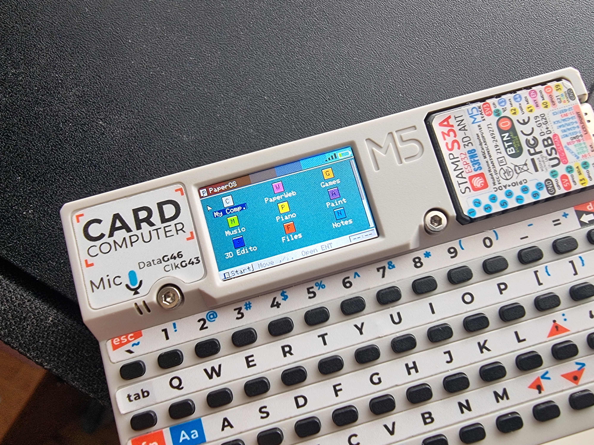
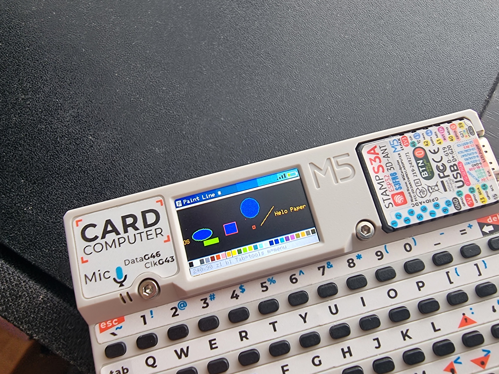
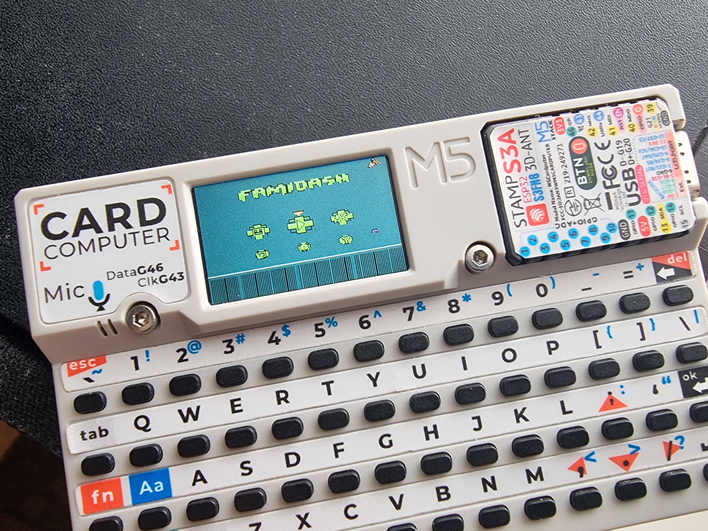
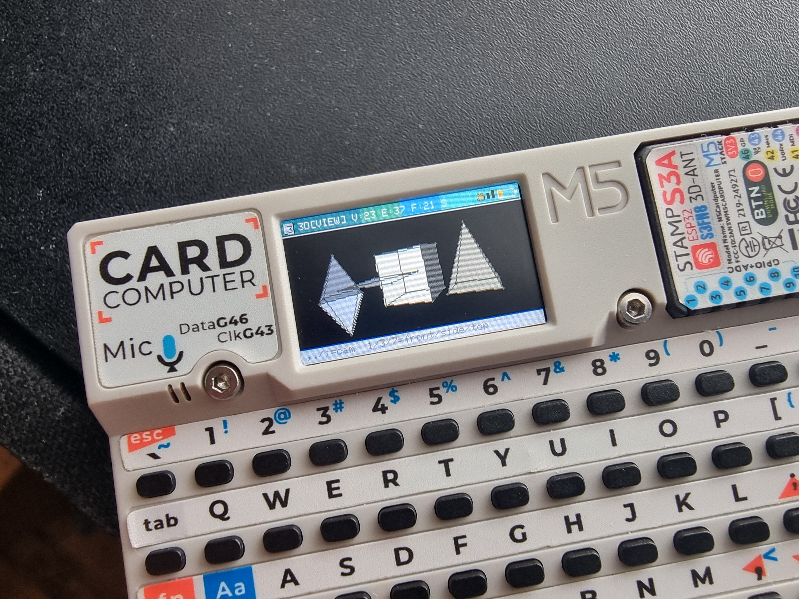
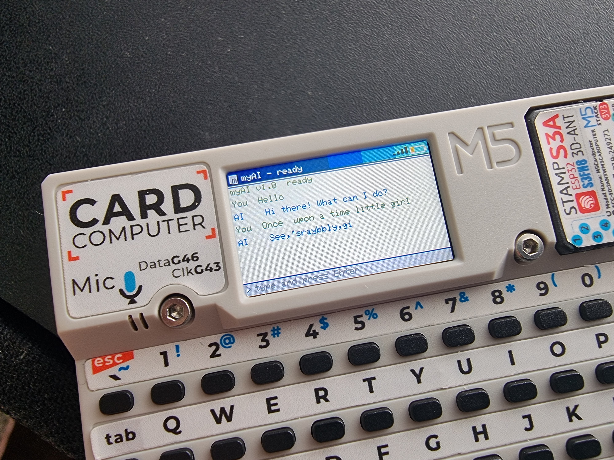
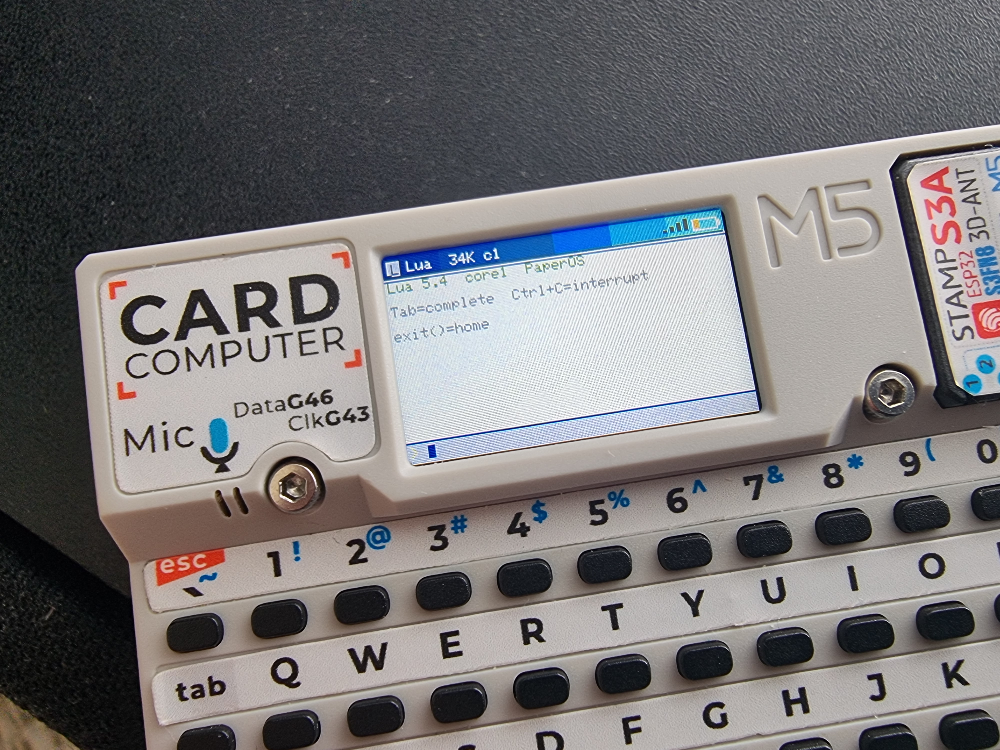
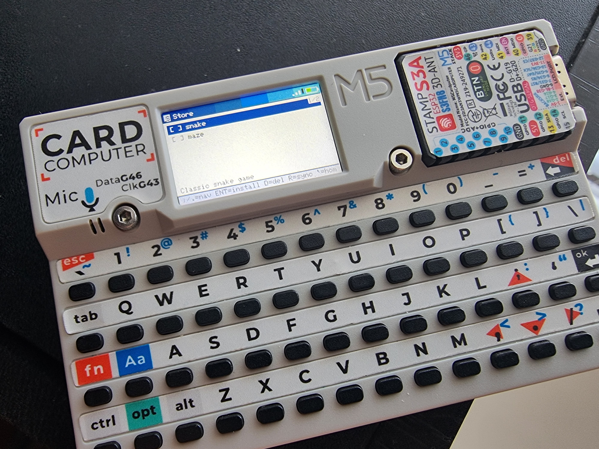

# PaperOS

A whole little OS for the M5Stack Cardputer. Launcher, file manager, paint, a text browser, a game emulator, an app store, an offline AI chat, a 3D editor, and a Lua console.

## What's new in v1.1

- **Store**: browse and install Lua apps/games from a scrollable list — select, hit Enter, done. No commands, no terminal.
- **HTTPS**: `net.get`/`net.post` and the Store itself now work over `https://`.
- SD card layout is unified under `/PaperOS/` (see the table below — folders moved from `/games/`, `/music/`, `/3d/`, `/saved_links/`).
- A round of Lua interpreter fixes found during hardware testing: a memory-corruption bug in `timer.every()`/`timer.after()` when a timer scheduled another timer from inside its own callback, a stuck interrupt flag that made the command right after Ctrl+C fail with a spurious error, `net.scan()` hard-blocking with no way to interrupt it, and GPIO calls having no protection against scripts stomping on board-internal pins (keyboard, SD bus, display, audio) — that last one now raises a clear error instead of corrupting board state. None of this changes how you write scripts, it just makes the interpreter behave the way the API always said it should.

## Get it running

Two ways to flash it:

- **No build needed**: flash `PaperOS_full_v1.1.bin` straight from your browser at [esphome.io](https://web.esphome.io/) (Connect → pick the file → address `0x0`), or through **M5Burner** — just search "PaperOS" in the app's search box and flash from there.
- **Build it yourself**: build with `pio run -e paperos-cardputer`, then run `merge.py` to bundle bootloader + partitions + firmware + LittleFS into `PaperOS_full.bin`, and flash that to address `0x0`.

Either way: if you're updating from an older build, do a full reflash, not incremental, the partition table has changed a few times. Put a FAT32 SD card in before first boot.

Source is shipped as `PaperOS_v1.1.zip` (main firmware) and `miniemu_for_v1.1.zip` (emulator core) rather than as loose files in the repo — GitHub's web uploader caps out at 100 files per commit and the firmware alone has more than that.

## Before you touch each app

| App | Needs |
|---|---|
| Games | `.nes`/`.gb`/`.gbc` need `PaperEMU.extension` (grab it from Releases, or use `EmulatorV3.4.extension` from AdvanceOS-for-cardputer if you prefer) + your ROMs, both in `/PaperOS/games/`. `.ard` (Arduboy) games need nothing extra, just the ROM in `/PaperOS/games/` |
| Store | nothing to set up, needs Wi-Fi. Installs apps to `/lua/` |
| myAI | `model.bin` in `/PaperOS/` |
| Music | `.wav`/`.mp3` in `/PaperOS/music/` (or open one from File Manager, it'll copy itself over) |
| 3D Editor | `.obj` files in `/PaperOS/3d/` |
| Browser | saves pages to `/PaperOS/saved_links/` |
| Paint | opens/saves anywhere, any name, no fixed folder |

## The apps

**File Manager** knows what it's looking at, images open in a viewer with zoom/pan/rotate, ROMs launch through the emulator, audio hands off to Music, everything else gets identified instead of dumped as garbled text. `M` for a context menu instead of memorizing hotkeys.

**Paint**: Pen, Line, Rect, FillRect, Ellipse, Circle, Triangle, Fill, Eraser, EyeDropper, Outline, Text. `Tab` opens tools/colors, Enter picks and closes it, `M` for Save/Open/New/Exit.

**Games**: NES and GB/GBC through PaperEMU (`EmulatorV3.4.extension` from AdvanceOS-for-cardputer works too, if that's what you've got). Arduboy `.ard` games flash straight to the spare OTA slot, no emulator extension needed. First launch of a `.nes`/`.gb`/`.gbc` ROM flashes the emulator into that same OTA slot; after that, switching games is just a reboot. `Games/` in this repo ships a couple of homebrew ROMs to try things out with — bring your own for anything else.

**Store**: a scrollable list of apps, fetched over HTTPS from a GitHub-hosted index. Move the selection with `;`/`.`, hit Enter to install, that's it — no terminal, no typed commands. `D` removes the selected app, `R` refreshes the index. Works offline after the first sync (index is cached). Installs straight to `/lua/`. The index is small for now, but new Lua apps/games will be added regularly, so hit `R` every so often to see what's new.

**Music**: WAV/MP3 player, volume and play/pause.

**Browser**: text only, no JS/CSS/images. Started as its own project (PaperWeb) before moving in here. `D` saves a page, `B`/`L` for bookmarks, `OPT` for its own file manager.

**myAI**: a tiny language model trained from scratch on TinyStories, fully offline. There's no RAM to hold the model, so it rereads its weights off the SD card for every single character it generates. That means replies are genuinely slow (the screen shows a live `thinking X/95 Ns` counter so it doesn't look frozen) and short. This is the actual mechanism, not a bug.

**3D Editor**: orbit/vertex editing for `.obj` meshes, `Tab` switches modes, `1`/`3`/`7` for front/side/top view.

**Lua**: a real Lua 5.4 console with its own API. `Tab` completes, `Ctrl+C` interrupts, `dofile(path)` runs a script.

Quick reference by table:

- `os.*`: clock, time, launch(name), heap(), reset(), bright(0-100), millis(), cpu(), apps(), frametime()
- `fs.*`: ls(path, asTable), read, write, rm, mkdir, exists, size, rename, copy, free, total — SD paths take `/sd` or `/SD`, otherwise LittleFS
- `net.*`: ip, mac, ssid, rssi, status, scan, connect, disconnect, get(url), post(url, body) — https:// works now
- `gpio.*`: mode, write, read, aread, awrite, tone, notone — errors on pins the board uses internally (keyboard, SD bus, display, audio) instead of letting a script corrupt them
- `disp.*`: cls, print, pixel, line, rect, fillrect, circle, fillcircle, triangle, text, clip, flip (call flip to push to screen)
- `key.*`: pressed(name), justPressed(name), released(name), any(), poll(). Names: up/down/left/right, enter, tab, del, ctrl, shift, fn, space, esc, or any single key
- `sound.*`: tone, note("C4"), stop, volume, play(path)
- `timer.*`: every(ms, fn), after(ms, fn), cancel(id)
- `ui.*`: confirm, toast, inputText, progress, menu({...})
- `store.*`: get/set, persists across reboots (Lua's own NVS key/value store — not the Store app)
- `json.*` / `bit.*` / `i2c.*`: as you'd expect
- `loop(fn, fps)`: the game loop driver, calls fn() until it returns false or Ctrl+C
- standard `io.open`/`file:read`/`file:write` on top of the same filesystem

Full function-by-function reference with exact signatures and known quirks is in `paperos_lua_reference_v1_1_verified.txt`.

**Notes / Calculator / Clock / Piano / Settings / SysInfo**: smaller utility apps, all with `;`/`.`/Enter/`` ` `` style controls, self-explanatory once you're in them. SysInfo is just a quick read-only screen of device stats.

## Known issues

- Browser is slow on big pages and the bookmark menu can lag sometimes. Text-only by design, always will be.
- myAI gives short, sometimes broken sentences and is genuinely slow, see above, that part's expected. If it just sits on "ready" forever and never responds at all, that's an actual bug, please report it with a screenshot.
- Lua's API has been through a hardware testing pass this release (see What's new above), but heavy scripts (big graphics loops, deep recursion) still aren't fully stress-tested.
- PNG/JPG viewing in File Manager depends on an M5GFX feature that isn't guaranteed to build on every library version. BMP always works regardless.
- If anything crashes or reboots on its own, that's worth reporting with what you were doing right before.

## Reporting bugs

Say what you did, what you expected, what happened instead. Screenshots help a lot since the screen is small.

## Credits

Built by Artem76228. Emulator core is GPLv2-licensed (source included in this repo) and compatible with the AdvanceOS-for-cardputer emulator. myAI's model trained from scratch on TinyStories.
